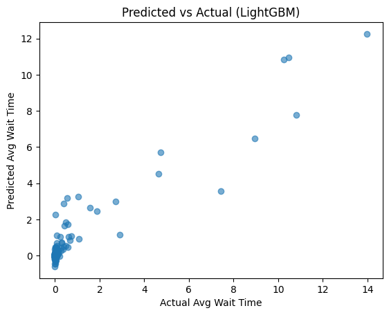

# Data Generation using Modelling and Simulation for Machine Learning

## Overview
This project demonstrates how **simulation-based data generation** can be used to build and evaluate **machine learning models**. An open-source simulation framework (**SimPy**) is used to model a dynamic system, generate synthetic data, and train multiple ML models to predict system behavior.

The complete workflow — **simulation → dataset → ML → evaluation** — is implemented in **Google Colab**.

---

## Simulator Used
### **SimPy (Simulation in Python)**

SimPy is an open-source, process-based **discrete-event simulation framework** implemented in Python. It is lightweight, fast, and fully compatible with Google Colab.

**Why SimPy?**
- Open-source and free
- Pure Python (no system-level dependencies)
- Extremely fast (1000 simulations in seconds)
- Ideal for ML-oriented data generation

---

## Problem Statement
To predict the **average waiting time** in a service system using machine learning, based on parameters generated through simulation.

---

## Simulation Model
A **queueing system** is simulated where:
- Customers arrive randomly (Poisson process)
- A fixed number of servers provide service
- Each customer experiences a waiting time before service

Each simulation run outputs the **average waiting time**, which becomes the target variable for machine learning.

### Input Parameters and Bounds

| Parameter | Description | Range |
| :--- | :--- | :--- |
| **Arrival Rate** | Customer arrival rate | 1 – 10 |
| **Service Rate** | Customer service rate | 2 – 15 |
| **Number of Servers** | Parallel servers available | 1 – 5 |

### Output Variable
- **Average Waiting Time**

---

## Data Generation
- **1000 simulation runs** were generated.
- Parameters were sampled randomly within predefined bounds.
- The resulting dataset was stored in CSV format.

The simulation process is fast and reproducible, making it suitable for machine learning pipelines.

---

## Machine Learning Models
The following regression models were trained and evaluated:

1. Linear Regression  
2. Random Forest Regressor  
3. Gradient Boosting Regressor  
4. XGBoost  
5. LightGBM  
6. CatBoost  

---

## Evaluation Metrics
Each model was evaluated using:
- **RMSE** (Root Mean Squared Error)
- **MAE** (Mean Absolute Error)
- **R² Score**

These metrics provide a comprehensive comparison of prediction accuracy.

---

## Results Visualization

### Predicted vs Actual Average Waiting Time (Best Performing Model)

The following plot shows the relationship between the **actual** and **predicted**
average waiting times for the best-performing model (**LightGBM**).

> The closer the points are to the diagonal line, the better the model’s prediction accuracy.

---

## Results Summary
Among all evaluated models, **LightGBM** achieved the **lowest RMSE** and the highest **R² score**. This indicates that LightGBM demonstrated superior performance in capturing the non-linear relationships present in the simulated queueing data.

---